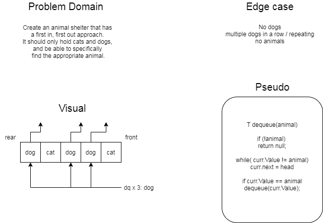

# FIFO Animal Shelter

## Sumarry

Behind the scenes, a linked list, acting as a queue, with two types of of animals available for adoption.  The animal shelter class is where you will find the first match whether you want to adopt a cat or a dog.

## Challenge
Generate a queue with cat and dog animal objects, that, when prompted for either a cat or dog, will search through the queue until it finds the first match \(cat or dog\).

## Approach and Efficiency

My partner and I drew up a white board solution \(as seen below\) to help understand the problem domain a bit better, but, ultimately, the pseudo code we wrote for the white board was not very accurate in the actual code solution.  I utilized generic type sets to define my methods such as they would only accept animal objects as a parameter. This allowed me to account for the edge case of the search parameter not being a cat or a dog.  Then, when called, the take home method traverses the queue until it finds the first match, cat or dog.  I also tested the edge case of the queue staying in the correct order when you remove an item from the middle.

## Solution

[Check the Code!](../Challenges/StacksAndQueues/AnimalShelter/AnimalShelter.cs)

