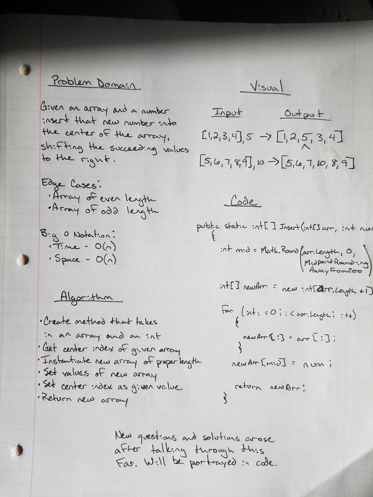

# Insert Into Array

## Summary

This is the second DSA for our 401 course. Using C# in the .NET Core framework, this project is simply for building unit tests to verify that methods work properly.  This weeks set of challenges are working with arrays in varying ways.

## Challenge

Given an array and an integer as input, return a new array with the integer having been inserted into the middle of the given array therefore shifting the succeeding numbers to the right.  For example:

- \[1, 2, 3, 4\], 5 should return as \[1, 2, 5, 3, 4\]

## Approach and Efficiency

The approach stage of this challenge ended up evolving once I took the white board processing period and started implementing it.  Again, using the white board method to break down the problem and understand how to go about finding a solution made the process easier to implement, but as it is, it took a lot more to get my unit tests passing.  It is not the most efficient method, but in the end, there are a lot of variables that we need access to in order to implement the solution.

## Solution

The solution holds an if else to set the middle index of our new array as half of the given array's length.  If the array is odd, the else for odd numbers uses Math.Ceiling and a cast to return an whole number as an integer.  Then, after instantiating a new array, there is a for loop with three if's that set the indeces of the new array accordingly.

