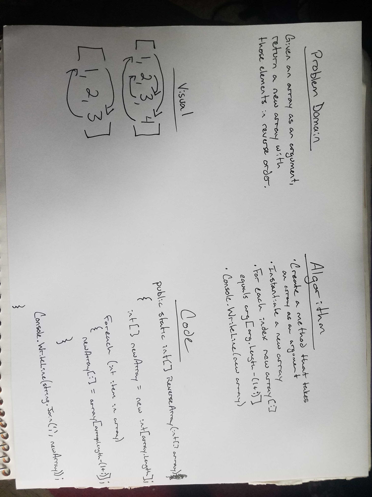

# Reverse an Array

## Summary

This is the first code challenge in our 401 .NET course. Utilizing C# and Visual Studio Community to create a new console application there is a Project.cs for this particular challenge.  This app takes given input, writes that array to the console, and then writes the new output to the console.  The method created in this challenge only works with arrays of integers.

## Challenge

Write a method that, given an array of any length as an argument, negative numbers allowed, returns a new array with all of the elements in the original array in reverse order.

## Approach and Efficiency

Using a white board approach we first defined the problem domain, drew a visual representation of what needed to happen, created a list of the steps it would take to accomplish the task, and then hand wrote the code on paper to show what our method would look like before coding.  Then, with a total of four lines of code, created our desired method.  That method instantiates a new array with the length of the input array, then using a for loop assigns each index of the new array to the reversed order indeces of the input array.  I don't think there is anything we could have done to make this more efficient except that maybe the Console.WriteLine could have been in the main method instead of in the ReverseArray method, but it seems fair that the method it self is writing the array out for us each time it gets called.

## Solution

When I wrote the code I ended up using a for loop instead of a foreach as is written on the white board image.  As it is, the white board image would not work properly as "i" is never defined accordingly, hence the actual for loop.

