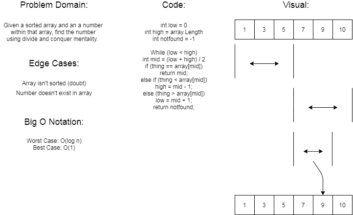

# Binary Search

## Summary

This is the third  DSA for our 401 course.  Within our .NET console app, inside of my array challenges class there is a method with two unit tests attached to it.

## Challenge

Given a sorted array of integers and a value, search the array for the desired value.  If that value exists return the index number of that value, else if the value doesn't exist in the array return -1.  Using a binary search to split the array in half if the given value is larger or smaller than the middle value of the array the array is reduced to only be that particular half of the array, exponentially decreasing until the value is either found or not.
 
## Approach

Using a white board approach to assess the problem domain and visualize\conceptualize the solution, we were able to write out a solution on paper that was actually very close to our actual solution.  There were a few minor adjustments that we needed to make once we started implementing the code, but ultimately we weren't very far off.

## Solution

Firstly we set a couple of variables to access specific indeces of the given array; the low point, the high point and the mid point.  Then, inside a while loop, we set a couple of conditionals.  If the mid point value is equal to the given value we return that index. If the value of the mid point is greater than the given value we reset the low value to be mid point +1.  If the value of the mid point is less than the given value we reset the high point to mid -1.  Finally if none of that is true, the given value was not found so we return -1 instead to signify an index that doesn't exist.

[Code Lives Here](../Challenges/ArrayChallenges.cs)

