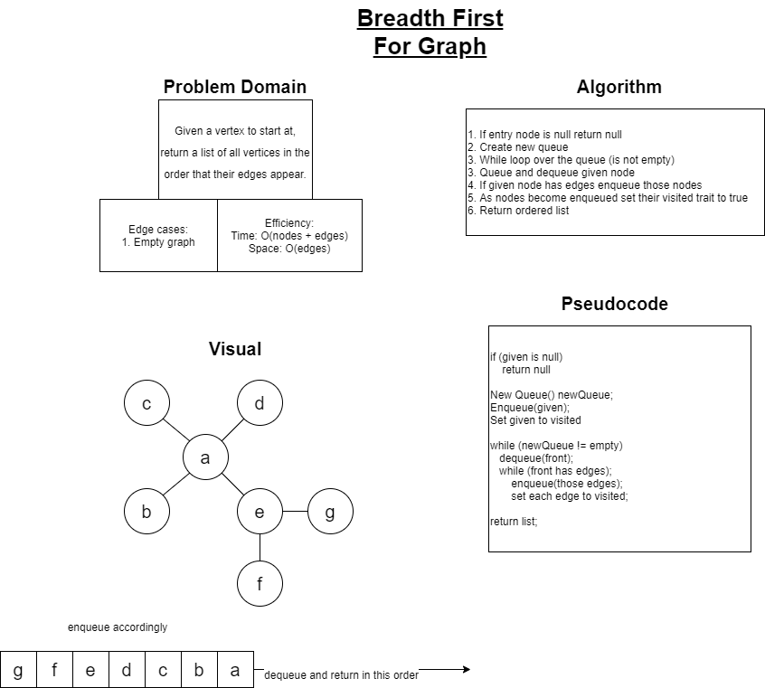

# Breadth First Graph Traversal

A breadth first traversal of a graph is implemented utilizing a queue internally, similar to a binary tree.  The first node gets enqueued, and then the front is dequeued and each of its neighbors are subsequently enqueued.  Everytime a node is enqueued you set its visited value to be true.  As each node is dequeued its respected neighbors that have not been visited are enqueued accordingly.  This process continues until the queue is empty.  Imagine a spider web where you start at the middle and then return each connection point of the next layer out until there are no more connections to return.

## Challenge

Given a vertex, perform a breadth first traversal starting at that vertex.

## Approach and Efficiency

A partner and I paired on a white board solution for this challenge; shown below.  We worked together to conceptualize a solution and then put our pseudocode to the test, literally!  Using unit tests, I utilized the red/green refactor methodology to ensure that my provided solution was working effectively.

[Check the Code!](../DataStructures/Graph/MyGraph.cs)  
[Check the Tests!](../DataStructures.Tests/Graph.Tests/MyGraphTests.cs)  
