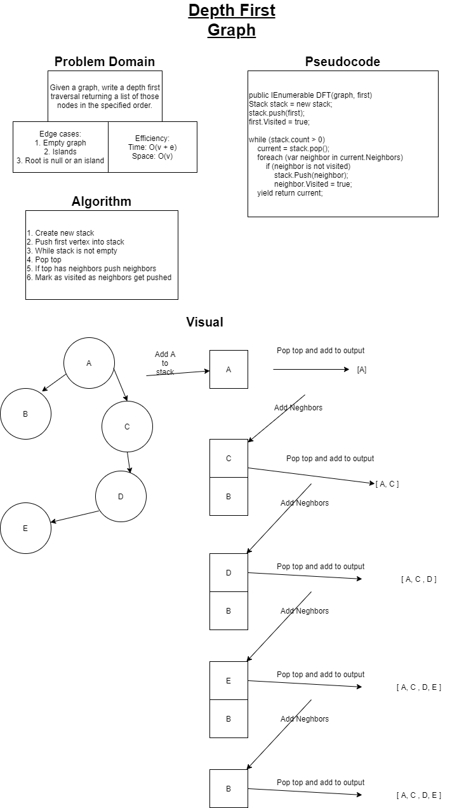

# Depth First Preorder Traversal

## Summary of the Challenge

Today's code challenge is to add a depth first traversal to my graph.  This means that, given a starting point, the algorithm will return a collection of all of the values from the graph in a particular order.  Specifically, the first node will come first, and then for all of its neighbors, the graph will travel down the line of edges for one neighbor returning each of those values subsequently, and then travel down the next path of neighbors accordingly, and so on.  This is different than breadth first in that it will return all of the nodes for a particular path in a graph and then move onto the next neighbor and path of nodes.

## Approach and Efficiency

Below you will see the white board solution that my partner and I worked together on.  Through doing so we were able to conceptualize our approach to a solution and have a stronger idea of how to implement the algorithm in the code.  Then, using TDD I was able to utilize the red/green refactor methodology of unit testing and verify the functionality of my algorithm and verify that edge cases were in fact being considered and handled correctly.  Check the links to see what you thinkg!

[Check the Code](../DataStructures/Graph/MyGraph.cs)  
[Check the Code](../DataStructures.Tests/Graph.Tests/MyGraphTests.cs)  
