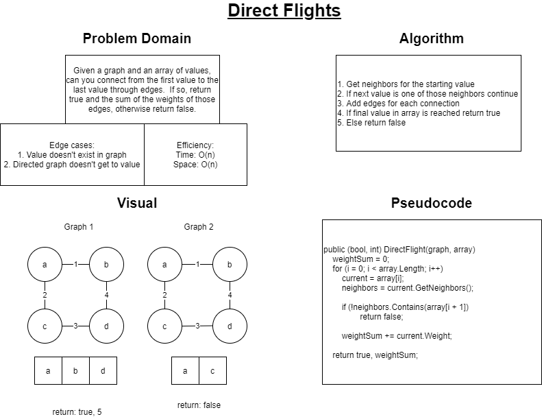

# Direct Flight Connection

Using flight paths as an analogy for defining edges between vertices in a graph, the idea behind today's challenge is to check whether a particular airport has a flight that will reach another particular place.  Whether the first vertex has a direct flight, or has to make a couple layovers to get there, we are checking whether we can reach that place or not.  For example, from Chicago, you can fly to New York, but LA has to layover in Chicago, and then go to New York.  Either way, this example would return true.  However, starting in LA, no matter how many layovers, there is no direct path or connection to Ireland, so this would return false.

## Challenge

Given a graph and an array of locations in that graph, check whether you can traverse from the first index to the last index of the array within the graph.  If there is a direct connection, return true and the total sum of the prices \(weights\) for that flight.  If the connection is not found, return false.

## Approach and Efficiency

A few of us got together and white boarded what a solution for this challenge would look like \(diagram below\).  The pseudocode is not completely accurate, but is a general representation of what the algorithm will look like by the end.  Utlizing TDD I will verify functionality to work out bugs that are apparent in the pseudocode.  The time and space efficiency for this algorithm are both O\(n\) as worst case has you iterating through the entire collection to find a connection.

[Check the Code](../DataStructures/Graph/MyGraph.cs)  
[Check the Tests](../DataStructures.Tests/Graph.Tests/MyGraphTests.cs)  
