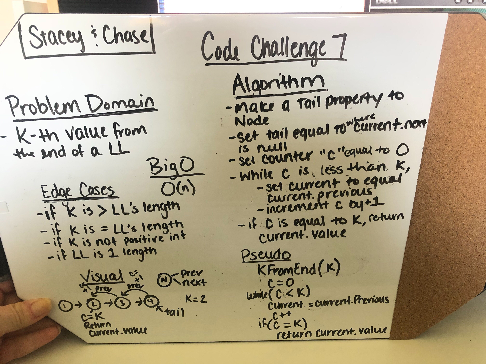

# Linked List Kth Value From End

Linked lists are challenging enough to traverse, none the less add items to, but how do we access the values in the list?  If you know exactly what value you are looking for, you can just sift through the list until you find your value.  But if you don't know what you're looking for how do you access items in the list?  This set of methods and unit tests identifies a way to access any given item in a list based on its index in the list, and just for gits and shiggles, let's find those values starting at the end of the list!

## Challenge

Given a value, write a method that will return the value of the node that is *k* indeces away from the end of a linked list.

## Approach and Efficiency

My partner and I used a white board solution to conceptualize our approach to a solution for this challenge.  After attempting to implement that in the code, our supposed solution was not efficient at all.  This is where TDD came in to save my butt.  Working through test by test, utilizing red, green, refactor, I was able to identify edge cases and work through, making sure that each test continued to pass along the way.  I even came to a point where I had written my test wrong because I my mind got boggled about how the code was working!  Eventually, and with some help, I was able to identify all of the minute discrepencies and solve the problem with all green tests.

## The Code

[My Solutions](../DataStructures/LinkedList.cs)