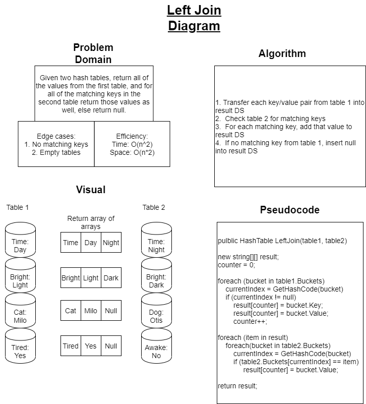

# Left Join Hash Tables

## Challenge

Given two hash tables, return all of the values from the first table, and for all of the matching keys in the second table return those values as well, else return null for that key from the first table.

## Summary

The challenge, as it was presented to me, is that the first table will have keywords as keys and a corresponding synonym as that key's value.  Then, the second table will have its own set of keywords with corresponding antonyms.  The algorithm will collect every key/value pair from the first table into a new data structure.  Then it compares every key from this new data structre to every key from the second table.  If at any point there is a matching key, the values of that key in the second table will be added to that index of the new data structure.  If there are no matching keys to be found, the slot that would get filled from table two instead will get populated by null.

## Approach and Efficiency

A partner and I approached this problem with a white board approach where we conceptualized and visualized what needed to happen.  We wrote some rough pseudocode, but as we move forward with our TDD there are discrepencies that will have to get worked out as we write the code and red/green refactor it accordingly.  The solution to this problem is fairly inneficient as you need to do a full traversal of each individual tree, or use a get enumerator to improve the time efficiency of this problem.  Space is also linear because you need to create a new data structure to capture all of the values accordingly.

[Check the Code!](../Challenges/HashTableStuff/LeftJoinTables.cs)  
[Check the Tests!](../Challenges.Tests/DuplicateSearch.Tests/LeftJoinTablesTests.cs)

