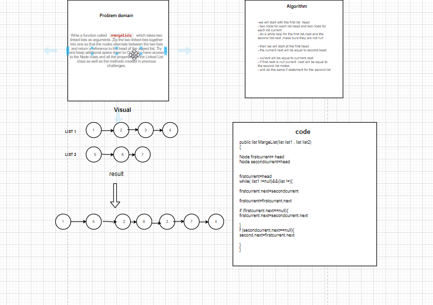

# Linked List Merge

There are a significant amount of edge cases to be considered with this DSA.  Inserting a new node into a list is tricky enough by itself, but being able to hop back and forth between two lists and set each node as the desired node is a whole new ball game.  Check it out below to see how I approached a solution!

## Challenge

Given two linked lists, merge them into one list, alternating nodes from each list \(see white board diagram\).  

## Approach and Efficiency

My partner and I spent about a half an hour working through a white board solution for this challenge, after which we had a generally decent idea of how to move forward with writing the code.  Once getting into the code, the solution presented far more problems than anticipated.  This was a very intricate challenge to find a solution for, but thus far I am keeping memory allocation to an O\(1\) solution, and time efficiency has remained at O\(n\).

As far as the code is concerned, I started with very small tests to make sure the program dependencies and references were set up properly, and then started breaking down the problem one step at a time.  There were many infinite loops, but once I got the loop situation fixed, every new turn presented a new null reference exception.  The solution is not fully implemented yet, but I think some specific and clever refactoring will lead me to an ultimate solution.  The code I have thus far is all functioning as expected, but a deeper level of refactoring will be the difference.

## The Code

[Check the Code!](../Challenges/LinkedListChallenges.cs)
