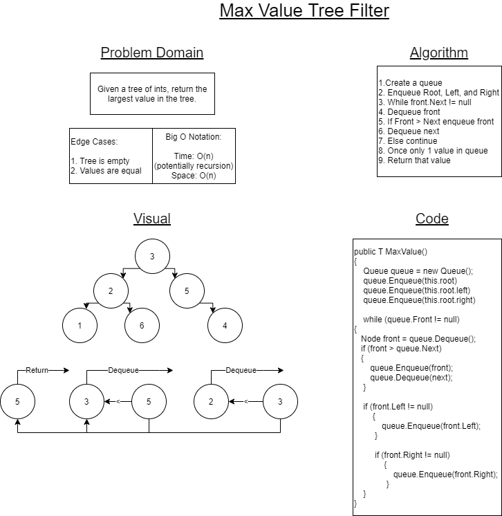

# Max Value Search Tree

## Summary

Our binary search tree can filter smaller values to the left and larger values to the right, but what if we need to find the largest value in an unorganized tree?  That's what we are here to solve today.  We are to write an algoithm that will traverse a tree and filter out values until the highest value in that tree is the only value left to return.

## Challenge

Given a binary tree, filter out and find the largest value in that tree.

## Approach and Efficiency

My partner and I approached this algorithm fairly confidently and had a couple of ideas as to how to go about it.  The solution we settled on below seemed to make the most sense to us even if it's not necessarily the most efficient.  Even so, we decided to utilize a queue in order to sift through and filter out the smaller values until finally there is only one item left in the queue to return.  It was not as easy as it seemed doing the white board however, and through the use of TDD and *much* debugging, I was able to slowly wittle down the problems as they presented themselves and find my solution!

[Check the Code!](../DataStructures/BinarySearchTree.cs)
[The Abstract Class!](../DataStructures/ComparableBinaryTree.cs)
[The Tests!](../DataStructures.Tests/BinaryTree.Tests/BinaryTreeTests.cs)

