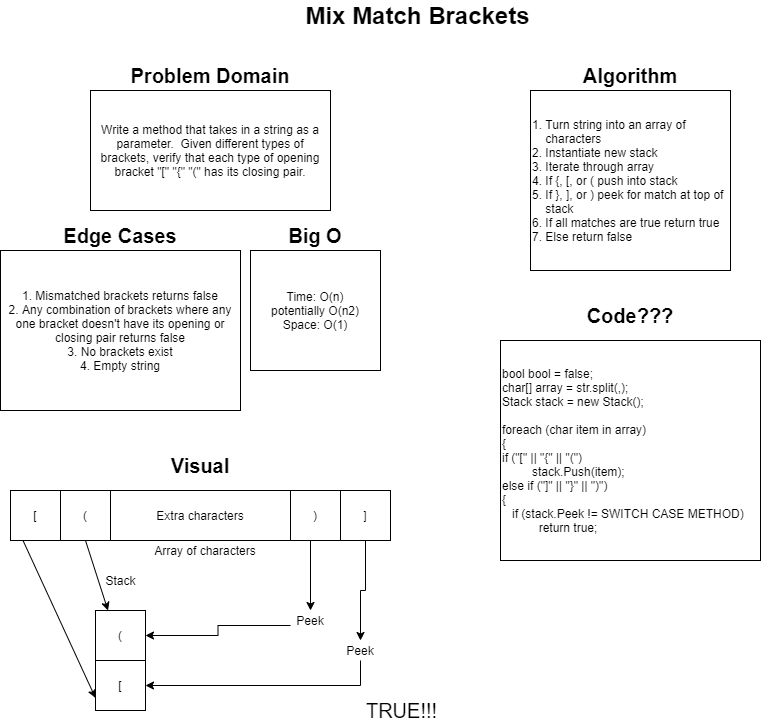

# Multi-Bracket Validation

## Summary

A combination of two methods that verify whether bracket types have their associated closing partner.  Imagine a behind the scenes verification that every parentheses, square bracket, and curly bracket have their closing partner and are in an acceptable order.

## Challenge

Given a string of any combination of characters that includes parentheses, curly brackets, or square brackets, verify that every type of bracket has its matching closing bracket and that those brackets are in proper order within the string \(see the code for more insight as to what edge cases and combinations of brackets can return true or false\).  Return true if the brackets in the string are in an acceptable order and paired correctly, otherwise return false.

## Approach and Efficiency

Our white board approach to understanding the problem was slow going at first, but as we talked through it more and more and considered our options for a solution we were able to do some auxiliary research and find a solution that made sense to all of us.  My TDD involves two tests that are both theories.  The first has a list of edge cases that should return true, and the second test has a list of edge cases that should return false.  As for the methods, I have the main method that sifts through the string and utilizes a stack to store all of the opening type brackets.  Then, whenever the character is a closing type bracket a switch\case method is called to verify that the value at the top of the stack pairs with the current closing bracket inside the foreach loop.

[Check the Code!](../Challenges/StacksAndQueues/MultiBracketValidation.cs)

