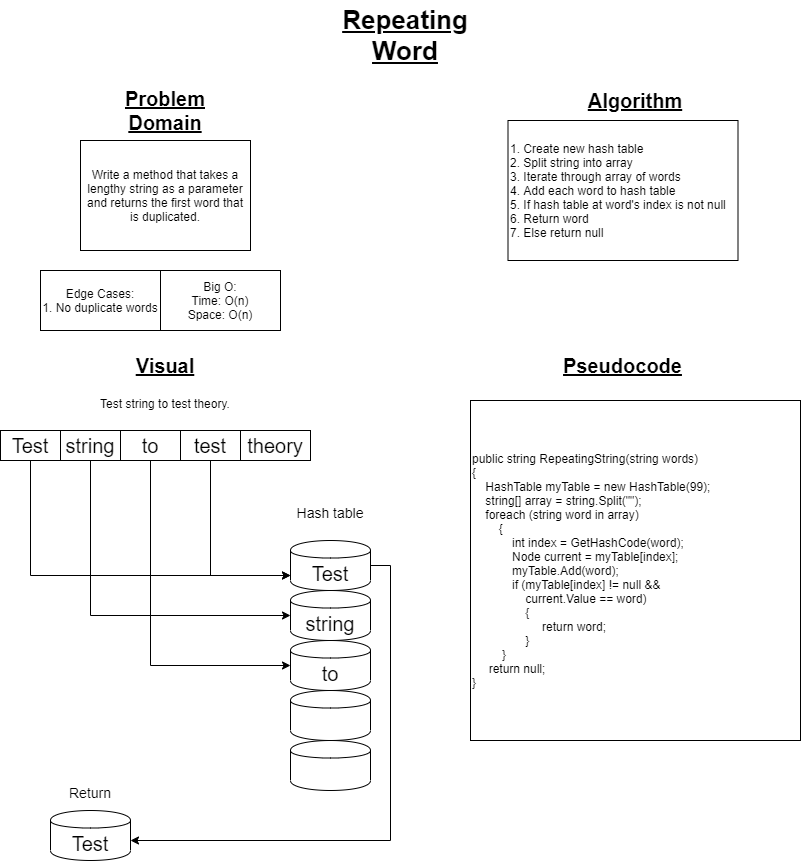

# Repeating Word

## Challenge

Write a method that takes a lengthy string as a parameter and returns the first word that is duplicated.

## Summary

Utilizing the hash table that I created from scratch, I am going to split the given string into an array.  Then, for each word in the string, I am going to add that string to the hash table until a condition is met.  Once the first collision occurs within a table I am then going to check the value of the item in the hash table to the current word I'm attempting to add to the table.  Once that matching value has been determined I will return that word and return out of the method.

## Approach and Efficiency

I started by drawing up a white board templated diagram to capture a visual representation of what will be happening in my method and to draw up an algorithm/pseudocode before moving forward with writing the code.  This white board break down of the problem is shown below, as well as links to the code and testing.  That being said, I utilized TDD to prove the functionality of my *repeating word* method following a red/green/refactor cycle.  The time and space efficiency for this particular challenge is O\(n\) because, worst case scenario, I need to create a list that is as long as there are words in the given string, and I will need to potentially iterate through every single word before finding a match, or not finding a match at all!

[Check the Code!](../Challenges/HashTableStuff/DuplicateSearch.cs)  
[Check the Tests!](../Challenges.Tests/DuplicateSearch.Tests/DuplicateSearchTests.cs)

