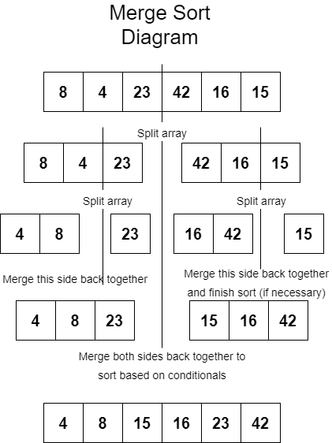

# Merge Sort

## Summary

A merge sort is a bit more efficient than the insertion sort from yesterday because it is a recursive solution to sorting.  The process takes in an array and splits it in half so that it sorts one side at a time.  It does rely on a helper method that merges the sub-arrays back together after the values have been broken out and sorts them accordingly.  The sorting itself actually only happens in the helper method when values are merged back together.

The first merge sort method recursively breaks the values out into sub arrays until the length of those arrays are one.  Then calls the merge method accordingly to put the values back together in the correct order.  Being recursive, the call stack can add up pretty quickly depending on the size of the array, but is an interesting sorting algorithm nonetheless.

## Approach and Efficiency

I was given pseudocode that acts as a general depiction of what the algorithm will look like in the code.  After reading through and breaking down what the algorithm looks like I created a white board diagram to visualize what is happening behind the scenes, as shown below.  The efficiency of this sort method is linearithmic, or O\(n log n\), because it is recursive.  It divides the array and conquers the sort by bringing it all back together much more efficiently than having to iterate through the entire array, potentially O\(n^2\).

[Check the Code!](../../Challenges/Sorts/MergeSort.cs)  
[Check the Tests!](../../Challenges.Tests/Sorts/MergeSortTests.cs)

