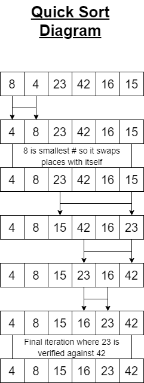

# Super Quick Sort

## Summary

The quick sort is another recursive algorithm that takes an array or list of items and sorts them in place.  As the algorithm iterates through each item in the array it captures the first item in the array to compare to every other item in the array, then switches places with the lowest item in the list.  This then puts that item in the position where everything smaller than it is to its left, and everything larger to its right.  It repeats this process by calling itself continuously until the final item has been iterated over, returning a sorted array.

## Approach and Efficiency

After being introduced to this algorithm I studied and read the pseudocode to get a more inimate understanding of how the moving parts are working together to compare the items in the list and arrange them accordingly.  I then put together the diagram below to visual what is happening each step of the way, or each iteration.  As the sort happens in place, space is constant, as efficient as it can be, but time efficiency is quadratic as worst case scenario, every single item will have to be compared to every other single item in the list, potentially every time.  Quadratic, in the big "O" world stands for O\(n^n\).

[Check the Code!](../../Challenges/Sorts/SuperQuickSort.cs)  
[Check the Tests!](../../Challenges.Tests/Sorts/QuickSortTests.cs)

