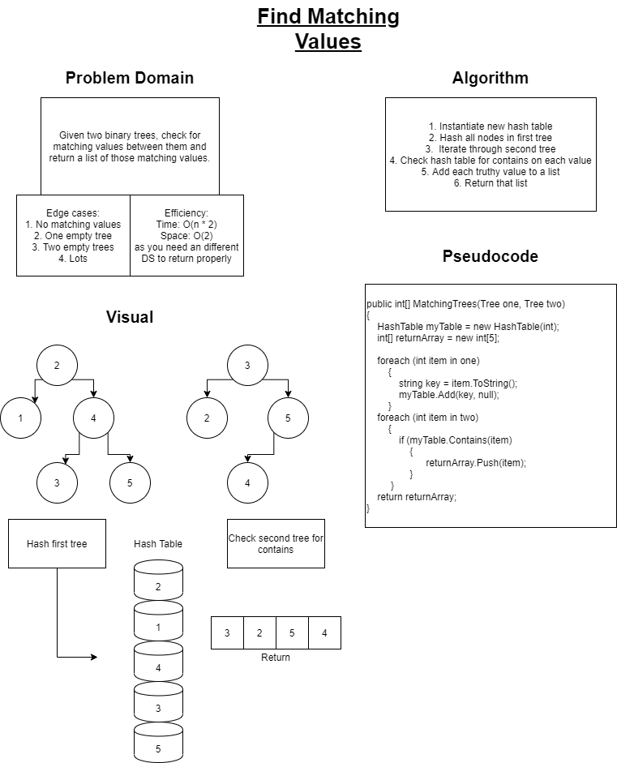

# Tree Intersection

## Challenge

Given two binary trees, define a method that uses a hash table to find values that appear in both trees.

## Summary

This challenge requires a way to compare every value from the first tree to every value from the second tree.  A hash table is a very effective way to do this because you can hash the first tree, and then, in the process of hashing the second tree, you can add any given value to a list when a collision occurs.  In the hash table world, a collision happens when two values have the same hash code and thus are placed at the same index in the hash table.  For our intents and purposes, we will be able to verify that matching values exist based on their placement in the hash table.

## Approach and Efficiency

A partner and I talked through an approach to writing a solution for this code challenge and then drew up a white board diagram to cover edge cases, big O notation, a visual representation, and pseudocode to step through our potential solution before actually diving into the code.  With a firm understanding of what the problem is, and how to approach it, we can move forward with our TDD to verify functionality using the red/green refactor methodology in unit testing.  Time efficiency for this problem is a little complicated as we have to iterate through two separate trees of potentially differing lengths, so worst case scenario is O\(n * 2\).  Space efficiency is also linear, as we have to create a hash table to sort out the values, and then create an array or list to return accordingly.

[Check the Code!](../Challenges/HashTableStuff/FindMatches.cs)  
[Check the Tests!](../Challenges.Tests/DuplicateSearch.Tests/FindMatchesTests.cs)

